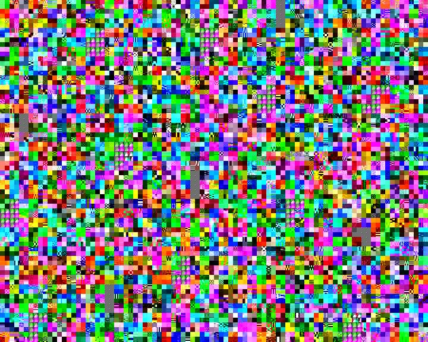
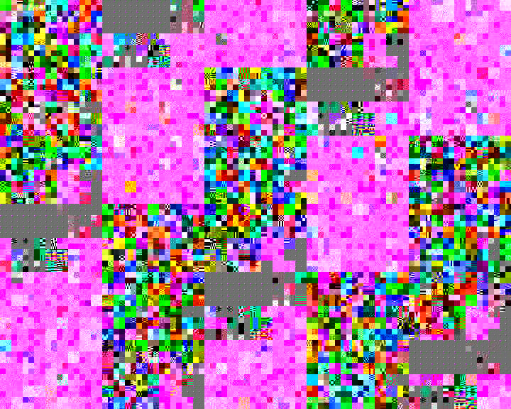
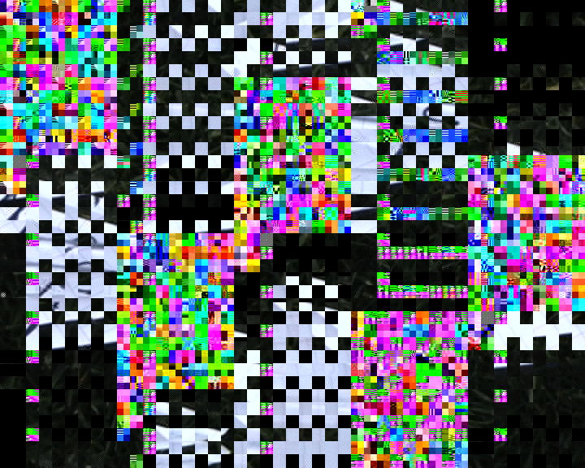
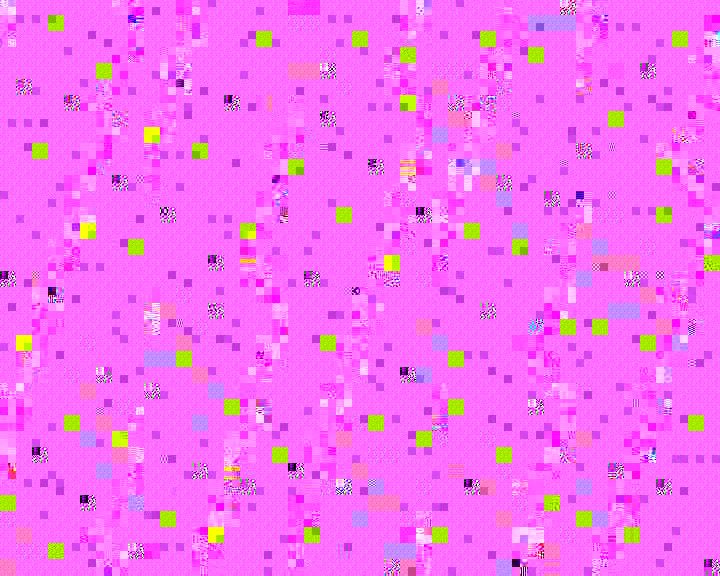
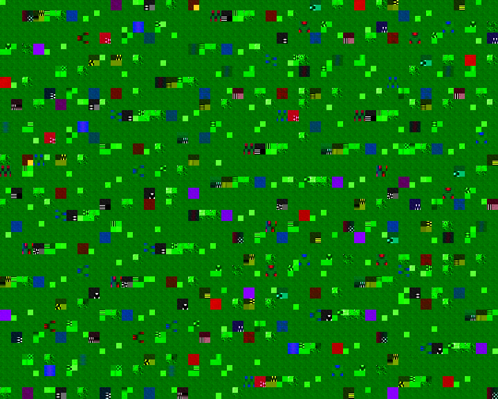

# Incidental Glitch Art

2018-02-14

### My old HDD decided it wanted to get all arty.

I was visiting my parents in the UK last year and gave myself the task of tearing out two old hard drives from PC towers gathering dust in the attic. It'd be a little difficult to pinpoint the precise lifespan of these machines but based on the data I recovered, the endless summer of 2003 (which ended, actually) is around the median.

Performing what's called a 'Deep Scan' (which sounds adequately Sci-Fi) on one of the reformatted HDDs revealed a whole bunch of odds and ends - some useful, some not so useful. HOWEVER, digging through a folder of video files that had been corrupted having been deleted and eventually recovered output some pretty whacky scenes in VLC.

Check some of these out.

Oooph. Make me a sweater with **that** on it.

Not so long ago I started working with my friend [Anthony Richardson](https://github.com/ajxs "Anthony Richardson") on a project called [Typereel](http://typereel.io "Typereel") and as it turn out there's a whole subculture for these warped visual representations of data. Anthony himself actually [built a tool](http://ajxs.github.io/jpk/ "Glitch Art tool by Anthony Richardson") to output images with controlled mutations of their own data. Now that is pretty dang cool.

The destruction of one thing to create another, in the context of art at least, isn't a new one obviously but I find the fact that it mutated or eroded data can such unexpected results quite fascinating. At the time, I paused to think about how if AI were to generate art it might turn out something like a [Mandelbrot Set](https://en.wikipedia.org/wiki/Mandelbrot_set "Mandelbrot Set"). I'd compare it to nature, which is also seemingly full of mutations (props to evolution) but I can't lie - I'm no science whizz so can't talk factually on the subject.
