# Professional Journal

12.09.2018

## Notes and musings, largely unedited

I heard Stephen King recently say [in an interview](https://www.youtube.com/watch?v=xR7XMkjDGw0) that the way he manages to write so many books in such a short space of time is to try to get at least 4 hours of writing done a day (which equates to 6 pages).

I can't promise 4 hours a day (yeesh!) but I can commit to maintaining a steady stream of research, theory and practical learnings.

Buckle up.

### The Seed

When applying for my MA Degree in Illustration at Notts Trent University I wanted to show that the last 5-10 years I had spent focused on web development could be recalibrated and focused on design problems, specifically using illustration as a medium.

I spent two days throwing together 'The Gendojack Series', a crude concept that illustrates how configurations of shapes can illustrate variations in the meaning of a word.

<figure markdown="1">

</figure>

This concept is shamelessly simple and was really only produced to illustrate a concept. Still, the seed of the idea  was enough to get me thinking about languages, in particular:

- **Computer generated visual languages** (I guess these exist??)
- **How languages have evolved over time and why they have evolved in particular ways**
- **Aspects of languages that are shared across existing social/cultural boundaries**

My first steps will be to investigate further on these points and explore the ideas that come from my findings.

14.09.2018

research

## People to research

### Paul Rand
The only knowledge I have of Paul Rand is that he designed the NeXT logo for Steve Jobs in the late 80s and was a major influence on 50s and 60s graphic design standards.

### David Carson
Broke the rules that had been set as industry standard by figures such as a Rand.

### Victor Papernack
Another influential figure in design.

## People to contact

[Natalie Braber](https://www.ntu.ac.uk/staff-profiles/arts-humanities/natalie-braber) | Associate Professor | School of Arts & Humanities, NTU. Dr Braber teaches in the School of Arts and Humanities within the subject area of Linguistics.

reflection

_What are forms of universal language?_

Symobolgy/Signage/Iconography?

Egyptian hieroglyphics/pictograms - Are these a form of language? How do these exist today?

findings

<figure markdown="1">
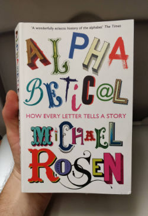
</figure>

I've purchased the book **'Alphabetical: How every letter tells a story'** by Michael Rosen. Extracts:

[Page 2]

> The letter A began it's life upside down (as we know it) in 1800BCE. By 1000BCE speed writing saw it rotated on it's side. The Greeks flipped it to allow for writing from left to right and the Romans rotated it further to give us the letterform we know today.

[Page 11]

> "...the ancient Sumarians, from what is now present day Iraq, developed a way of using symbols to represent syllables. An analogy would be if we had a symbol for a bird's beak or 'bill' based on a picture of a bird's bill. This 'bill' symbol could be used again and again in a word like 'building' (where our 'buil-' sounds the same as 'bill'), or in 'possible' (where our '-ble sounds like 'bill'). Another way to imagine the 'syllabic principle' is to think of the possibility of us using the ampersand, '&', to write 'hand' as 'h&'."..."In terms of trade, pictograms are an easier way to translate words because you don't have to use abstract symbols like 'h' or 'y' representing sounds in different languages. The pictogram for 'eye' will work for my word for 'eye' just as well as your word for 'eye', each of which may well sound completely different."

reflection

Language, to me, has always seemed such an _officially_ documented collection of _approved_ words and _slang_ the unofficial dregs leftover. Over time language evolves, but who are these officiators? How do words become officially accepted as part of a language?

The above passage indicates that in ancient times there were radical ideas about how a language should be used by society, presumably because it was a time of radical changes in society itself; economic growth, trade etc. Are there future radical changes that might necessitate further radical shifts in the way we use language?

research

Find out how languages are officiated

16.09.2018

findings

<figure markdown="1">
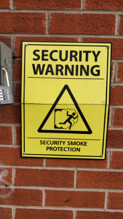
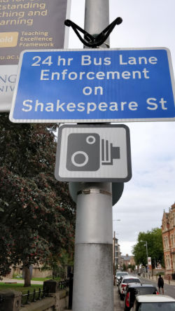
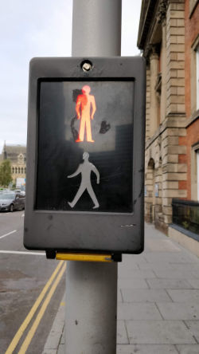
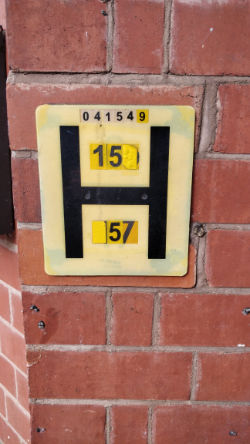
</figure>

Examples of symbols and pictographs we might see every day in signage. Perhaps the least familiar is the ['H' sign](https://commons.wikimedia.org/wiki/File:Fire_hydrant_UK.jpg) which indicates to members of the fire department the details of the corresponding hydrant.

I also purchased the book **'Philographics: Big ideas in simple shapes'** by Genis Carreras.

<figure markdown="1">
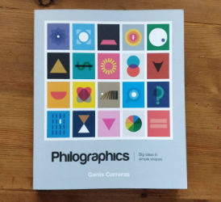
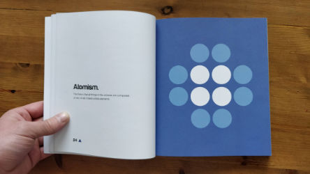
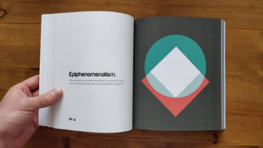
</figure>

This concept is quite interesting because it shows that even complex concepts can be represented by simple shapes.

17.09.2018

findings

reflection

<figure markdown="1">
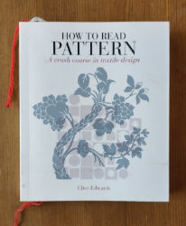
</figure>

This morning I was flicking through **'How to read pattern: A crash course in textile design'** by Clive Edwards, which sparked an interesting challenge in the representation of objects as symbols. For instance, take this pattern example:

<figure markdown="1">
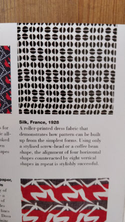
</figure>

The caption describes this pattern symbol as a screw top *or* a coffee bean. If this symbol were being used as part of a language to represent either one of these things then how would we know which one it represents? This isn't too different from the way the written (English) language contains words that can mean different things depending on their context.

**'Alphabetical: How every letter tells a story'** by Michael Rosen [Page 4]
> 'Ah!' is a very useful sound. It can mean many things depending on the notes you hit as you say it. You can indicate that you're surprised, that you knew it all along, that you're satisfied, that you've been hurt, that you're sympathetic, or you're pretending to be sympathetic, that you've caught someone out and so on.

Could there be _shared_ symbols with a way to distinguish between it's translation. This was originally the intention behind the Gendojack Series. **The same symbol can mean different things depending on it's rotation**. If not rotation then perhaps some visual key. Numbers maybe?

21.09.2018

reflection

<figure markdown="1">
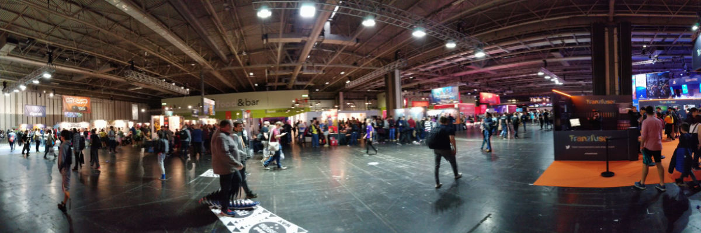
</figure>

Today was spent at EGX, a gaming exhibition in Birmingham. My friend, John Evelyn, was exhibiting his game 'The Collage Atlas' there and during the course of the day I played a bunch of other indie games that were inspiring in one way or another.

<figure markdown="1">
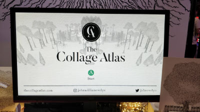
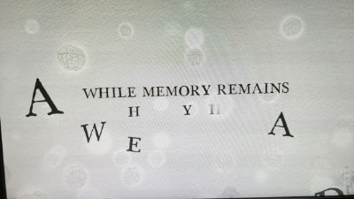
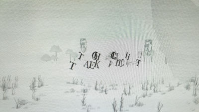
</figure>

What I found interesting about John's game (and incidentally about other indie games in general) was that they're all trying to _teach_ you something. Whether the learning is part of the actions within the game itself, or whether the learning was something **external from the game** did vary - for instance - I played an indie game that encouraged the user to be part of the story itself by rewriting the game's narrative. Thus I learned to co-create a story. I played another game that allowed the user to choose from different astrology outcomes as an astrologer in Shakesperian London. Thus I learned (briefly) about astrology. The medium of gaming is a pretty powerful vehicle for learning.

<figure markdown="1">
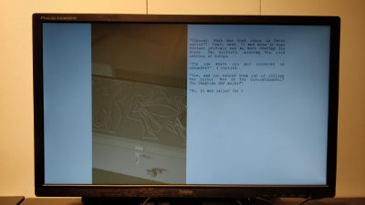
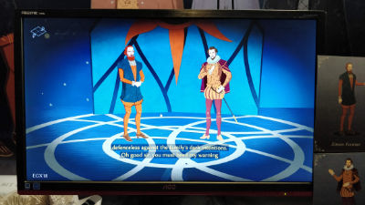
</figure>

research

This did open my mind up to the idea of researching gamification as a vehicle for education. Is it easier for people to learn a language, for instance, if they have a game-related incentive?

Also, I was stunned by how much raw creativity I found within a medium that mostly known as being self-contained within the games themselves. Contrary to that, I saw a LOT of raw/offline art to support the digital/game based art and direction. There was a physical _paper shredder_ characterised within a game that required the user to feed through paper in order to advance the story.

<figure markdown="1">
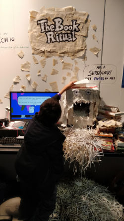
</figure>

Really inspiring stuff and opened me up to the idea of using games as a means of discovery.

reflection

Yesterday, I went to see the exhibition 'Trixx + Robert Haussmann | The Log-O-Rithmic Slide Rule: A Retrospective' at the Nottingham Contemporary gallery. I don't usually visit galleries; in fact, I find them pretty sterile places in which to appreciate art and I try to avoid them (this is usually easy enough). However, I was required to go as part of my course and so made a conscious effort for that _not_ to play a part in my judgement of the exhibition itself. It was...ok.

I decided not to read up on the designers before reviewing what I saw because honestly I feel as though it isn't necessary to know who the artist is in order to criticise art. <-- there are reasons why this is untrue but I feel as though in this instance it's true. Art is a confusing mess of rules.

Firstly my understanding was that the designers are furniture designers.

**Tangent**

Art is subjective. A furniture designer creates a piece of art that resembles furniture. It has no functional reason for being. It's just art. I'm comfortable with this, but...

**SUPER TANGENT**

 What I'm viewing is _now_ a piece of art in an exhibition but was _originally_ a concept for actual (functionally sound but artistic?) furniture.

 **Welcome back**
