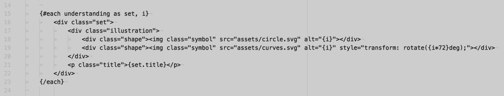
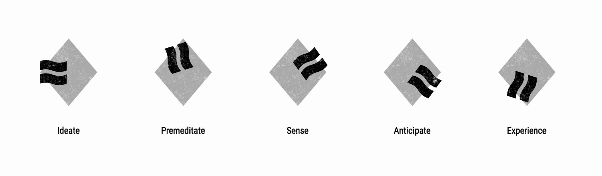

# Professional Journal

12.09.2018

## Notes and musings, largely unedited

I heard Stephen King recently say [in an interview](https://www.youtube.com/watch?v=xR7XMkjDGw0) that the way he manages to write so many books in such a short space of time is to try to get at least 4 hours of writing done a day (which equates to 6 pages).

I can't promise 4 hours a day (yeesh!) but I can commit to maintaining a steady stream of research, theory and practical learnings.

Buckle up.

### The Seed

The seed of this idea came in to being when applying for my MA Degree in Illustration at Notts Trent University. **Long story short:** I wanted to show that the last 5-10 years I had spent focused on web development could be recalibrated and focused on design problems, specifically using illustration as a medium.

I spent two days throwing together 'The Gendojack Series', a crude concept that illustrates how configurations of shapes can illustrate variations in the meaning of a word.

This concept is _shamelessly_ simple and was really only produced to illustrate a concept. Still, the seed of the idea  was enough to get me thinking about languages, in particular:

- **Computer generated visual languages** (I guess these exist??)
- **How languages have evolved over time and why they have evolved in particular ways**
- **Aspects of languages that are shared across existing social/cultural boundaries**

My first steps will be to investigate further on these points and explore the ideas that come from my findings.

14.09.2018

research point

## People to research

### Paul Rand
The only knowledge I have of Paul Rand is that he designed the NeXT logo for Steve Jobs in the late 80s and was a major influence on 50s and 60s graphic design standards.

### David Carson
This guy broke the rules that had been set as industry standard by figures such as a Rand.

### Victor Papernack
Another influential figure in design.

## People to contact

[Natalie Braber](https://www.ntu.ac.uk/staff-profiles/arts-humanities/natalie-braber) | Associate Professor | School of Arts & Humanities, NTU. Dr Braber teaches in the School of Arts and Humanities within the subject area of Linguistics.

light bulb moment

_What are forms of universal language?_

Symobolgy/Signage/Iconography?

Egyptian hieroglyphics/pictograms - Are these a form of language? How do these exist today?
